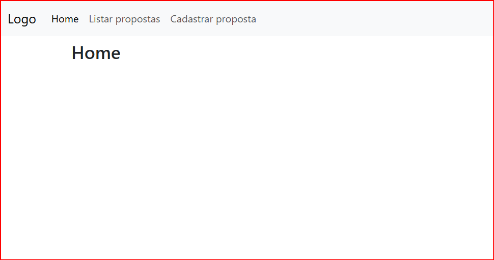

# Desafio Técnico: Gestão de Propostas de Venda

## Objetivo
Desenvolver uma aplicação para gerenciar propostas de venda, incluindo a criação, listagem e alteração de status das propostas. O objetivo é avaliar suas habilidades em **PHP, Laravel e boas práticas de desenvolvimento**.

## Requisitos
### 1. Estrutura da Proposta de Venda
Cada proposta de venda deve conter os seguintes campos:
- **ID** (Identificador único)
- **Data de Cadastro** (Preenchida automaticamente no momento da criação)
- **Data de Finalização** (Preenchida apenas quando o status for "Finalizado")
- **Item Vendido** (Campo obrigatório, deve ter entre **5 e 50 caracteres**)
- **Valor (R$)** (Campo obrigatório, deve ser **positivo e maior que R$ 0,01**)
- **Status da Proposta** (Relacionado a outra tabela, com os seguintes valores fixos):
  - **Aberto** (padrão ao cadastrar)
  - **Em Análise**
  - **Finalizado**
  - **Cancelado**

### 2. Regras de Cadastro de Propostas
- O **Item Vendido** deve conter entre **5 e 50 caracteres**.
- O **Valor da Proposta** deve ser **positivo e maior que R$ 0,01**.
- O **Status da Proposta** sempre inicia como **"Aberto"**.
- O cadastro de status da proposta não precisa de tela, pois os valores são fixos.

### 3. Gestão de Propostas
A aplicação deve permitir:
- **Cadastrar uma nova proposta**
- **Alterar apenas o status e a data de finalização da proposta**
  - Para cada alteração, o usuário deve registrar uma **observação**
  - O sistema deve armazenar um **log** das alterações realizadas, contendo:
    - Quem cadastrou a proposta
    - Quem alterou o status
    - Qual foi a descrição da alteração
    - Horário da alteração
- **Após a finalização de uma proposta, nenhuma alteração será permitida**

### 4. Listagem de Propostas
- Criar uma tela para listar todas as propostas cadastradas.
- **Não é necessário implementar paginação ou pesquisa.**
- As colunas exibidas devem ser:
  - **ID** (com link para visualizar os detalhes da proposta)
  - **Item Vendido**
  - **Valor**
  - **Status da Proposta**
  - **Data de Cadastro**
  - **Data de Finalização**

## Tecnologias
O candidato tem liberdade para escolher as tecnologias do frontend, mas o backend deve ser desenvolvido utilizando **Laravel**.

## Entrega
- Disponibilizar o código em um repositório público (GitHub, GitLab, Bitbucket).
- Criar um arquivo **README.md** com as instruções para rodar o projeto:
  - Passos para configurar o ambiente
  - Como rodar as migrations e seeders
  - Informações sobre usuário e senha de teste para login (se houver necessidade)

## Critérios de Avaliação
1. **Funcionamento**: O sistema atende a todos os requisitos funcionais?
2. **Código**: O código está bem estruturado, seguindo boas práticas?
3. **Registro de alterações**: A rastreabilidade das mudanças está bem implementada?
4. **Interface**: A interface é clara e intuitiva?

Boa sorte! ??

## **PASSO A PASSO RODAR APLICAÇÃO**

### Aplicação Laravel que contém o cadastro de proposta de venda, edição do status e data final e listagem das propostas
#### A aplicação foi feita toda em Laravel 12 (última versão até a presente data). Na aplicação não implementei o sistema de login, o log pega um usuário teste do banco de dados, mas já deixe o log pré pronto para conectar com o usuário autenticado faturamente.

### **Observação**
- É recomendável ter o docker rodando na máquina para executar os passos abaixo

#### Fazendo uso do terminal, clone o projeto:
```powershell
git clone https://github.com/tiagotsc/laravel12.git
```   

#### Na pasta raiz (tem as pastas phpdocker, sistema e arquivos docker-compose.yml e README.md), rode:
```powershell
docker-compose up -d
```

#### Entre no container php com o comando:
```powershell
docker-compose exec php-fpm bash
```

#### Ainda dentro do container entre no diretório da aplicação:
```powershell
cd laravel
```

#### Instale os pacotes com o seguinte comando:
```powershell
composer install
```

#### Cria as tabelas
```powershell
php artisan migrate
```

#### Alimenta as tabelas
```powershell
php artisan db:seed
```

#### No navegador, acesse a aplicação através da seguinte URL:
- http://localhost

#### Tudo ocorrendo bem, vocês irão se deparar com a seguinte tela:


